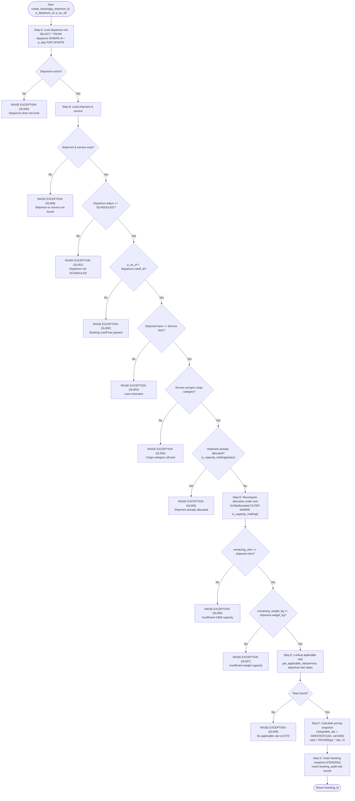

# SmartLCL - Transaction-Safe Booking Workflow & Concurrency Architecture

This document describes the internal execution flow of the `create_booking()` PostgreSQL database function, the serialization mechanism, and the rationale behind pessimistic row locking.

---

## 1. Flowchart of `create_booking()`



---

## 2. Core Concurrency Rationale (The Viva Defense)

### Question:
> **Why do we lock the departure row before recalculating capacity?**

### Authoritative Answer:
Because in a high-volume freight booking system, multiple concurrent client transactions can issue booking requests simultaneously for the same voyage.

1. **The Concurrency Hazard**: If transactions relied on cached or unlocked queries (such as reading `v_departure_availability`), both transactions would simultaneously see the same unallocated physical capacity (e.g. 15 CBM available). Transaction A would create a 10 CBM booking, and Transaction B would concurrently create an 8 CBM booking. Both would commit, resulting in **18 CBM allocated on a 15 CBM vessel (an illegal physical oversell)**.
2. **The Serialization Anchor**: By executing:
   ```sql
   SELECT * FROM departure WHERE id = p_departure_id FOR UPDATE;
   ```
   as the **very first operation**, PostgreSQL acquires an exclusive row-level write lock on the target departure.
3. **Queueing & Fresh State**: If Transaction B arrives while Transaction A is executing, Transaction B's thread **blocks and sleeps on the lock**. As soon as Transaction A commits, Transaction B wakes up, obtains the lock, and **dynamically recomputes the allocated capacity from the `booking` table**. Transaction B immediately sees Transaction A's newly committed 10 CBM allocation, detects that only 5 CBM remains, and cleanly aborts with `SL006 (Insufficient CBM capacity)`.
4. **No Mutable State Stored**: No mutable columns like `remaining_cbm` or `remaining_weight_kg` exist on the `departure` row. The departure row serves purely as the serialization mutex, while capacity is derived on-demand from the historical ledger of capacity-holding bookings.
